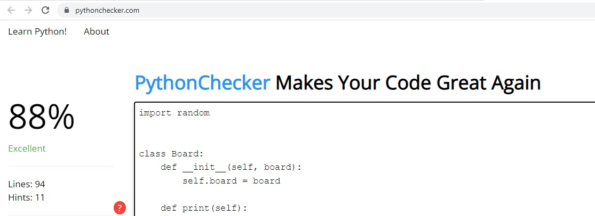
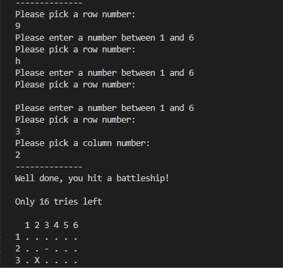

# ahmad-battleship is a python terminal game, which runs on Heroku
ahmad-battleship is a simple version of the traditional battleship game. Users can try to beat the computer by finding all of the computer's battleships (which are set to three) throgh 18 attempts. Each battleship occupies one square on the board. 
[Here is the live version of my project.](https://ahmad-battleship.herokuapp.com/)
 
 
 
# How to play 
This game is based on the classic pen-paper game. In this version, the board is randomly generated and the player cannot see where the ships are located.
Attempted guesses are marked on the board with a - . Hits are indicated by x . The player then has 18 attempts to hit all the ships. If the ships are hit successfully, then a congratulation message is displayed to the used.
# Features
- Random board generation: ships are randomly generated and the player cannot see where the shps are.

- play against the computer 
- Accept user input
- Maintain score 
 
 

 
 
- Input validation and error checking 
- You must enter numbers 
- You cannot enter the same guss twice 
 
 

 
 
# Data model
I decided to use a board class and a ship class as my model. The game creates the board using the board class. 
The ship class stores the number of ships, the position of the ships, the guesses against the board.
The classes also have methods to help play the game, such as a print method to print out the current board, an add-ship method to add ships to the board, make-guess and score methods to add a guess and return the result.
## Technologies used
1. GIThub 
2. Python
3. paint 
4. Heroku
# Testing
I have maually tested this project by doing the following: 
  
 

 
 
- Passing the code through an online code validator (https://www.pythonchecker.com/) and it looked good as shown in the image above. 
 
 

 
 
- Giving invalid input. This includes a number outside the specified scope, empty input or when the input is not a number.
- Testing the game in my local terminal and in Heroku terminal
# Bugs & Improvement
When I wrote the project, I had some indentation errors and extra spaces which I fixed.
Validator testing pep8: no errors were found. 
There is no specific feedback to user on what was wrong exactly which I need to improve. 
## Deployment
The project was initiated and developed on Github, then it was deployed to Heroku website.
## Credits
The idea of the prject, main structure, and error handling mechanism were inspired by the Code Institute website.   
## Acknowledgement
I would like to thank the Code Institute team for their contiuous support. 