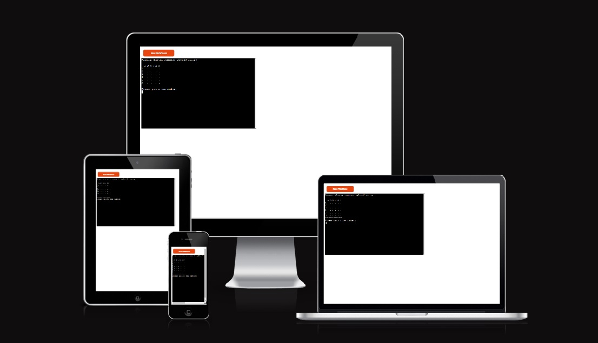
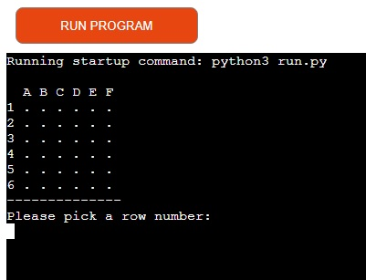
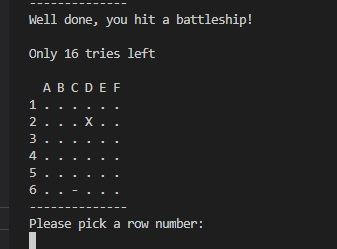
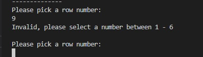

# ahmad-battleship is a python terminal game, which runs on Heroku
Users can try to beat the computer by finding all of the computer's battleships throgh 18 attempts. Each battleship occupies one square on the board. 
[Here is the live version of my project.](https://ahmad-battleship.herokuapp.com/)
 
# How to play 
This game is based on the classic pen-paper game. In this version, the board is randomly generated and the player cannot see where the ships are located.
Guesses are marked on the board with a - . Hits are indicated by x . The player then has 18 attempts to hit all the ships.
# Features
- Random board generation: ships are randomly generated and the player cannot see where the shps are.

- play against the computer 
- Accept user input
- Maintain score 

- Input validation and error checking 
- You must enter numbers 
- You cannot enter the same guss twice 

# Data model
I decided to use a board class and a ship class as my model. The game creates the board using the board class. 
The ship class stores the number of ships, the position of the ships, the guesses against the board.
The classes also have methods to help play the game, such as a print method to print out the current board, an add-ship method to add ships to the board, make-guess and score methods to add a guess and return the result.
# Testing
I have maually tested this project by doing the following 
- Passed the code through a pep8 linter and confirmed ther are no problems 
- Giving invalid input 
- Tested in my local terminal and in Heroku terminal
# Bugs 
When I wrote the project, I had some indentation errors and extra spaces which I fixed.
Validator testing pep8: no errors were found.
Deployment
This project was deployed using Heroku website.